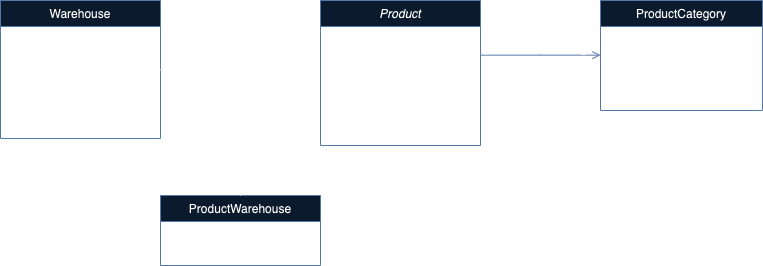

# ING CRUD PROJECT

Create an API that acts as a store management tool

- Create a Github profile if you don't have one

- Use git in a verbose manner, push even if you wrote only one class

- Create a Java, maven based project, Springboot for the web part

- No front-end, you can focus on backend, no need to overcomplicate the structure

- Implement basic functions, for example: add-product, find-product, change-price or others

- Optional: Implement a basic authentication mechanism and role based endpoint access

- Design error mechanism and handling plus logging

- Write unit tests, at least for one class

- Use Java 9+ features

- Add a small Readme to document the project

## Features

- **Product Management**: CRUD operations for products.
- **Warehouse Management**: CRUD operations for warehouses and product assignments.
- **Role-based Access Control**: Secure endpoints with roles (`ADMIN`, `USER`).
- **Caching**: Utilizes Redis for caching data.
- **Validation**: API input validation using Jakarta Bean Validation.
- **Exception Handling**: Custom exception handling for better error management.

## Technologies Used

- **Spring Boot**: Framework for building the application.
- **Spring Security**: For authentication and authorization.
- **MySQL**: Database for persistent storage.
- **Redis**: Caching layer.
- **Hibernate**: Persistence layer.
- **Docker**: Containerization for the application.
- **JUnit**: Testing framework.
- **SL4J**: Logging
- **Flyway**: Database migration

## Implementation



The application models a basic product management operations. Each product has one category assoccciated to it and can
be stored in multiple warehouses.

### `Product` and `Category` relationship

In order to model this, a one to many relationship is required between the `Product` entity and `ProductCategory`. I
chosen this approach over a simple string field on the `Product` entity because:

- it is more open to extensibility such as assigning multiple categories to a product or handling products based on
  category
- no need to modify the code when introducing a new category, just a SQL script given that categories should not be
  updated as often and are usually predefined

### `Product` and `Warehouse` relationship

Because a `Product` can be stored in multiple `Warehouses` a many to many relationship needs to be modeled. This is done
using a link table, which in our case requires an additional row for storing the quantity of the `Product`
in a certain `Warehouse`. In order to model this using Hibernate an entity `ProductWarehousee` needs to be created for
the link table and two many to one relationships with embedded id.

Apart from the main entities there is also a `Useer` entity used for authentication, which uses a `NaturalId` and cache
since for this application users are only retrieved by their username in the authentication process.

The rest of the application is a has a simple MVC architecture consisting of `Services` and `Controllers` in order to
perform operations on the entities.

## Running the application

### 1. Using Docker

For convenience, a docker configuration is provided so the application can be run without the need to set the local
environment manually. This will start the MySQL, Redis, and your Spring Boot application while creating the database and
setting the required properties.

```shell
docker-compose build
docker-compose up
```

This will expose the application on `localhost:8080`

### 2. Running locally

#### 1. Start the MySQL Database:

Ensure MySQL is running locally and the database ing_crud is created with appropriate configurations.

#### 2. Start the Redis server:

Ensure Redis is running locally and the connection details are set correctly.

#### 3. Configure Application Properties:

Update `src/main/resources/application.yml` with the necessary database and Redis configurations.

#### 3. Run the Application:

```shell
mvn spring-boot:run
```

## API Endpoints

The following APIs are exposed:

### Authentication

#### Security

- **Roles**: `ADMIN`, `USER`
- **Endpoints**: Secure endpoints using `@PreAuthorize` based on roles.

For simplicity, two users are predefined since the operations for user management are not implemented.

##### Admin

- **username**: `admin`
- **passwordd**: `apassword`

##### Observer

- **username**: `observer`
- **passwordd**: `opassword`

Obtain JWT token by providing username and password:

- **Endpoint:** `/api/auth/login`
- **Method:** `POST`
- **Request Body:**
  ```json
  {
    "username": "string",
    "password": "string"
  }
  ```
- **Response:**
    - **200 OK:**
      ```json
      {
        "token": "string"
      }
      ```
    - **401 Unauthorized:** Invalid credentials.

### Product management

#### Get All Products

- **Endpoint:** `/api/products`
- **Method:** `GET`
- **Response:**
    - **200 OK:**
      ```json
      {
        "products": [
          {
            "id": 1,
            "name": "Product Name",
            "description": "Product Description",
            "price": 99.99,
            "category": "Category Name"
          }
        ]
      }
      ```

#### Get Product

- **Endpoint:** `/api/products/{id}`
- **Method:** `GET`
- **Response:**
    - **200 OK:**
      ```json
      {
        "id": 1,
        "name": "Product Name",
        "description": "Product Description",
        "price": 99.99,
        "category": "Category Name"
      }
      ```
    - **404 Not Found:** Product not found.

#### Create Product

- **Endpoint:** `/api/products`
- **Method:** `POST`
- **Request Body:**
  ```json
  {
    "name": "Product Name",
    "description": "Product Description",
    "price": 99.99,
    "category": "Category Name"
  }
  ```
- **Response:**
    - **201 Created:**
      ```json
      {
        "id": 1,
        "name": "Product Name",
        "description": "Product Description",
        "price": 99.99,
        "category": "Category Name"
      }
      ```

#### Update Product

- **Endpoint:** `/api/products/{id}`
- **Method:** `PUT`
- **Request Body:**
  ```json
  {
    "name": "Updated Product Name",
    "description": "Updated Product Description",
    "price": 79.99,
    "category": "Updated Category Name"
  }
  ```
- **Response:**
    - **200 OK:**
      ```json
      {
        "id": 1,
        "name": "Updated Product Name",
        "description": "Updated Product Description",
        "price": 79.99,
        "category": "Updated Category Name"
      }
      ```
    - **404 Not Found:** Product not found.

#### Delete Product

- **Endpoint:** `/api/products/{id}`
- **Method:** `DELETE`
- **Response:**
    - **204 No Content:** Successfully deleted.
    - **404 Not Found:** Product not found.

#### Assign Product to Warehouse

This endpoint is used to assign a product to one or more warehouses with a given quantity. If the assign operation fails
i.e. the warehouse does not have enough capacity an error response is returned and none of the assignments is made.

- **Endpoint:** `/api/products/{productId}/assign`
- **Method:** `POST`
- **Request Body:**
  ```json
    [
      {
        "warehouseId": 1,
        "quantity": 10
     },
     {  
        "warehouseId": 2,
        "quantity": 20
     }
  ]
  ```
- **Response:**
    - **200 OK:**
      ```json
      {
        "id": 1,
        "name": "Product Name",
        "description": "Product Description",
        "price": 99.99,
        "category": "Category Name"
      }
      ```

## Error Responses

- **400 Bad Request:** Invalid input data.
- **401 Unauthorized:** Authentication failed.
- **403 Forbidden:** Access denied.
- **404 Not Found:** Resource not found.
- **500 Internal Server Error:** Unexpected server error.

```

### Warehouse Management

#### Get All Warehouses

- **Endpoint:** `/api/warehouses`
- **Method:** `GET`
- **Response:**
    - **200 OK:**
      ```json
      {
        "warehouses": [
          {
            "id": 1,
            "address": "Warehouse Address",
            "capacity": 1000
          }
        ]
      }
      ```

#### Create Warehouse

- **Endpoint:** `/api/warehouses`
- **Method:** `POST`
- **Request Body:**
  ```json
  {
    "address": "Warehouse Address",
    "capacity": 1000
  }
  ```

- **Response:**
    - **201 Created:**
      ```json
      {
        "id": 1,
        "address": "Warehouse Address",
        "capacity": 1000
      }
      ```

## Postman collection

For convenience, a Postman collection is provided under `ING Crud API.postman_collection.json` in order to easily
explore and test the API.